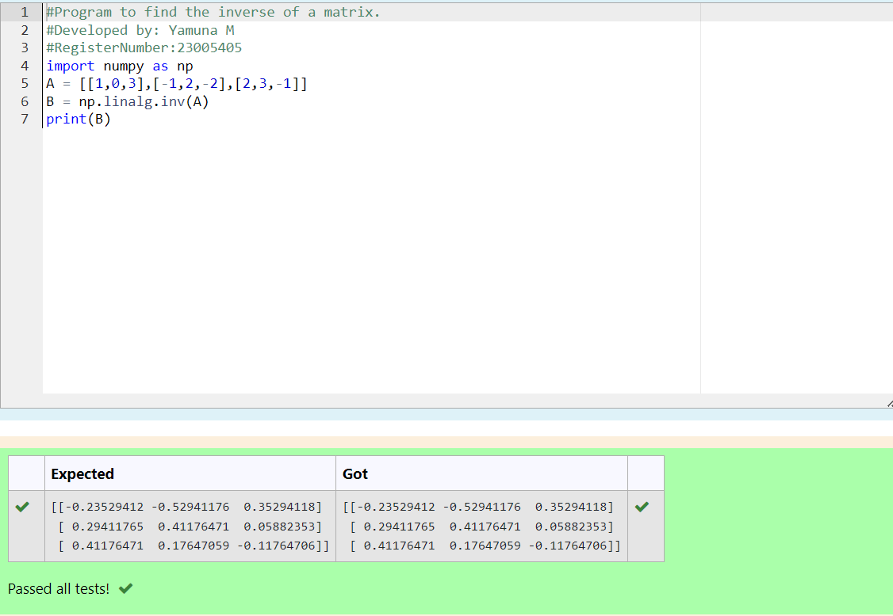

# INVERSE-OF-A-MATRIX
## Aim:
To write a python program to find the inverse of a matrix
## Equipment’s required:
1. 	Hardware – PCs
2. 	Anaconda – Python 3.7 Installation / Moodle-Code Runner
## Algorithm:
### Step1 : 
Import the numpy module to use the built-in functions for calculation
### Step 2: 
Prepare the lists from the matrix and assign in np.array()
### Step 3:
Using the np.linalg.inv(), we get the result
### Step 4: 
End the program
## Program:
```
#Program to find the inverse of a matrix.
#Developed by: Yamuna M
#RegisterNumber:23005405
import numpy as np
A = [[1,0,3],[-1,2,-2],[2,3,-1]]
B = np.linalg.inv(A)
print(B)
```
## Output:

## Result:
Thus the inverse of given matrix is successfully solved using python program

